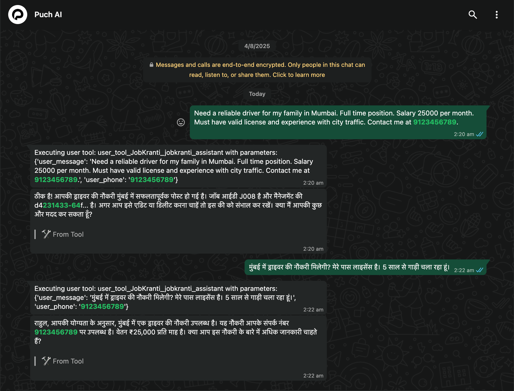
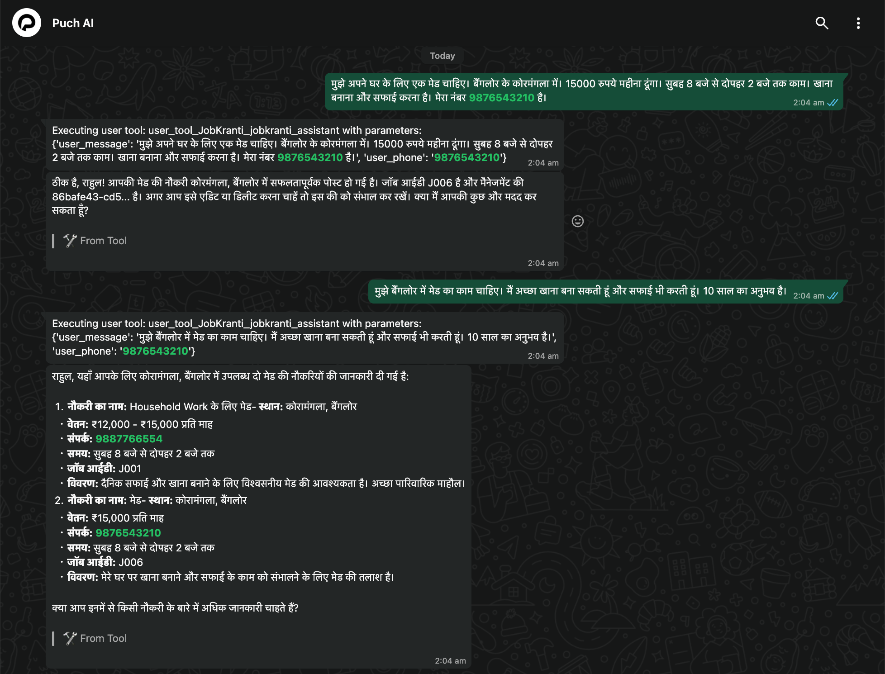
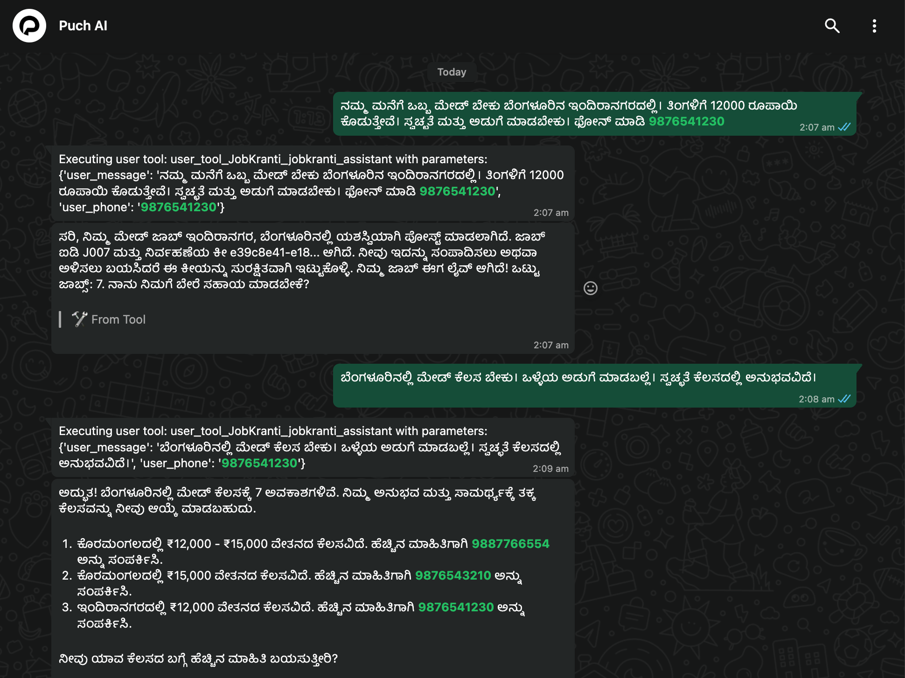

# JobKranti AI - Voice-First Multilingual Job Platform for Blue and Grey collar Jobs

> **India's First Voice-First, AI-Powered Job Marketplace for Blue-Collar Workers**
> **Built for PuchAI Hackathon 2025**

## Some Examples








JobKranti AI bridges India's employment gap by connecting 450M+ blue-collar workers with employers through **voice-powered, multilingual AI assistance**. Users can speak in their native language, and our AI understands context, urgency, and provides appropriate job matches.

---

## The Problem We Solve

| Challenge | Impact | Our Solution |
|-----------|---------|--------------|
| **Language Barriers** | 450M+ workers struggle with English-only platforms | **13+ Indian languages** with voice support |
| **Technology Gap** | Limited smartphone literacy in rural areas | **Voice-first interface** - no typing needed |
| **Emergency Employment** | Urgent survival needs not addressed | **Emergency job finder** with immediate options |
| **Inefficient Matching** | Generic job portals miss context | **AI understands desperation** vs casual browsing |

---

## Key Features

### Voice-First Design
- **WhatsApp voice messages** in 13+ Indian languages
- **Real-time transcription** using OpenAI Whisper
- **Culturally appropriate AI voices** for responses
- **No reading required** - perfect for users with limited literacy

### AI-Powered Intelligence
- **GPT-4o understands colloquial** job descriptions in local languages
- **Smart intent recognition** - knows when someone desperately needs work
- **Emergency job finder** - provides immediate survival options
- **Context-aware responses** - understands family situations and urgency

### Multilingual Support
```
Hindi | Tamil | Telugu | Bengali | Marathi | Gujarati | Kannada 
Malayalam | Punjabi | Urdu | Odia | Assamese | English
```
- **Code-mixing support** - understands Hinglish and other mixed languages
- **Regional job categories** - Mumbai finance support, Bangalore tech assistance, Delhi security

### Secure & Scalable
- **MCP Server Architecture** - Built for PuchAI integration
- **Bearer Authentication** - Secure API access
- **SQLite + Cache** - Fast performance with data persistence
- **Rate limiting** - Prevents abuse while ensuring accessibility

---

## Quick Start Guide

### Prerequisites
```bash
- Python 3.11+
- OpenAI API key
- WhatsApp number for validation
```

### Installation
```bash
# Clone and setup
git clone <repo_name>
cd jobkranti-ai

# Setup environment
cp .env.example .env
```

### Environment Configuration
```env
# Required for full functionality
AUTH_TOKEN=your_secret_bearer_token_here
MY_NUMBER=919998881729  # Your WhatsApp number (country_code + number)  
OPENAI_API_KEY=sk-your-openai-api-key-here

# Optional
DATABASE_URL=sqlite:///jobkranti.db
LOG_LEVEL=INFO
```

### Run Server
```bash
uv run main.py
```

**Server URLs:**
- Main server: `http://localhost:8086`
- Health check: `http://localhost:8086/health`
- MCP endpoint: `http://localhost:8086/mcp`

---

## PuchAI Integration

### Connect to PuchAI
```bash
# In PuchAI chat
/mcp connect https://your-domain.com/mcp/ YOUR_AUTH_TOKEN
```

### Available MCP Tools
| Tool | Purpose | Example |
|------|---------|---------|
| `validate` | Server validation | Returns phone number |
| `jobkranti_assistant` | Main AI assistant | Handles all job operations |
| `process_voice_message` | Voice processing | Transcribes + responds |

---

## Real-World Use Cases

### 1. Domestic Worker Finding Job

**Input (Voice in Hindi):**
```
"मुझे बैंगलोर में मेड का काम चाहिए। मैं अच्छा खाना बना सकती हूं।"
```

**Expected Output:**
```
मिली 3 मेड नौकरियां बैंगलोर में:

**1. Maid for Household Work**
Location: Koramangala, Bengaluru
Salary: ₹12,000 - ₹15,000/month
Contact: 9887766554
Hours: 8 AM - 2 PM
Job ID: J001

---
```

### 2. Employer Posting Job

**Input (English):**
```
"Need a security guard for my office in Delhi. Night shift. Good salary."
```

**Expected Output:**
```
सिक्यूरिटी गार्ड की नौकरी सफलतापूर्वक पोस्ट हो गई!

Job ID: J006
Title: Security Guard
Location: Delhi
Salary: ₹18,000 - ₹22,000/month

Management Key: abc123...
(Save this key for editing/deleting)

Your job is now LIVE!
```

### 3. Emergency Employment

**Input (Hindi with urgency):**
```
"कोई भी काम चाहिए तुरंत। बच्चे भूखे हैं।"
```

**Expected Output:**
```
तुरंत काम की जरूरत - Emergency Job Options

आज ही शुरू करें:
- Zomato/Swiggy delivery: Local hub में जाकर register करें
- Ola/Uber: Online apply करें (bike/car चाहिए)
- Construction daily wages: पास के construction sites पर जाएं
- House cleaning: आस-पास के घरों में पूछें

Daily Earning Potential:
- Daily labor: ₹500-800/day
- Food delivery: ₹800-1500/day

हिम्मत रखें! - JobKranti आपकी मदद करेगा।
```

### 4. Voice Message Processing

**Input (Voice in Tamil):**
```
[Voice message: "சென்னையில் டிரைவர் வேலை கிடைக்குமா?"]
```

**Expected Output:**
```
Voice Message Processed

You said: "சென்னையில் டிரைவர் வேலை கிடைக்குமா?"

Found 2 driver jobs in Chennai:

**1. Driver for Family**
Chennai, T Nagar
₹20,000 - ₹25,000/month
Contact: 9444555666
```

---

## Testing Commands

### Employer Job Posting Tests

```bash
# Hindi
"मुझे बैंगलोर में मेड चाहिए। 15000 रुपये महीना। फोन 9876543210"

# English  
"Need driver in Mumbai. 25000 salary. Contact 9123456789"

# Kannada
"ಬೆಂಗಳೂರಿನಲ್ಲಿ ಮೇಡ್ ಬೇಕು। ತಿಂಗಳಿಗೆ 12000 ರೂಪಾಯಿ"

# Tamil
"சென்னையில் செக்யூரிட்டி கார்டு வேண்டும। மாதம் 18000"
```

### Job Seeker Search Tests

```bash
# Hindi
"दिल्ली में ड्राइवर की नौकरी मिलेगी?"

# English
"Looking for security guard job in Mumbai. Urgent work needed."

# Code-mixing (Hinglish)
"Bangalore mein cleaning job chahiye. Housework kar sakti hun."
```

### Emergency Tests

```bash
# Hindi
"कोई भी काम चाहिए तुरंत। घर में खाना नहीं है।"

# English
"I need any work urgently. Family emergency. Can start today."
```

### Browse & Search Tests

```bash
# Show all jobs
"बैंगलोर में सभी नौकरियां दिखाओ"
"Show all jobs in Delhi"

# Salary-based search
"15000 रुपये तक की नौकरी मुंबई में"
"Find cleaning jobs under 20000 salary"
```

---

## Technical Architecture

### System Overview
```
PuchAI WhatsApp ↔ JobKranti MCP Server ↔ OpenAI GPT-4o ↔ SQLite Database
                              ↕
                    Voice Processing (Whisper + TTS)
```

### Core Components
- **FastMCP Server** - Model Context Protocol integration for PuchAI
- **OpenAI Integration** - GPT-4o for NLU, Whisper for voice, TTS for responses
- **SQLite + Cache** - Persistent storage with in-memory performance
- **Pydantic Models** - Structured data extraction from natural language
- **Bearer Authentication** - Secure API access with rate limiting

### Key Technologies
- **Python 3.11+** with FastMCP framework
- **OpenAI GPT-4o** for natural language understanding
- **SQLite** for data persistence
- **aiosqlite** for async database operations
- **Pydantic** for data validation and structure

---

## Demo Data Included

The server includes realistic demo jobs for immediate testing:

| Job Type | Location | Salary Range | Contact |
|----------|----------|--------------|---------|
| **Maid** | Bangalore, Koramangala | ₹12,000-15,000/month | 9887766554 |
| **Security Guard** | Delhi NCR | ₹18,000-22,000/month | 9876543210 |
| **Delivery Partner** | Mumbai, Andheri | ₹25,000-35,000/month | 9123456789 |
| **Cook** | Chennai, T Nagar | ₹20,000-28,000/month | 9444555666 |
| **Driver** | Bangalore, Whitefield | ₹22,000-30,000/month | 9988776655 |

---

## API Documentation

### Health Check
```bash
GET /health
```

**Response:**
```json
{
  "status": "healthy",
  "service": "JobKranti AI - Voice-First Job Platform",
  "features": {
    "voice_processing": true,
    "multilingual": true,
    "ai_powered": true
  },
  "stats": {
    "active_jobs": 5,
    "languages": 13,
    "job_categories": 10
  }
}
```

### Main AI Assistant (via MCP)
```json
POST /mcp
{
  "jsonrpc": "2.0",
  "method": "tools/call",
  "params": {
    "name": "jobkranti_assistant",
    "arguments": {
      "user_message": "Driver job chahiye Mumbai mein",
      "user_phone": "919876543210"
    }
  }
}
```

### Voice Processing (via MCP)
```json
POST /mcp
{
  "jsonrpc": "2.0",
  "method": "tools/call", 
  "params": {
    "name": "process_voice_message",
    "arguments": {
      "audio_data_base64": "base64_encoded_audio_data",
      "user_phone": "919876543210"
    }
  }
}
```

---

## Why JobKranti AI?

### For Blue-Collar Workers
- **No English barrier** - Speak in your mother tongue
- **No typing needed** - Just send voice messages
- **Emergency support** - Get immediate survival job options
- **Respectful treatment** - AI understands your dignity and needs

### For Employers 
- **Find reliable help** - AI matches based on actual requirements
- **Easy posting** - Just describe what you need in natural language
- **Manage jobs** - Edit/delete with secure management keys
- **Local language support** - Communicate in preferred language

### For the Ecosystem
- **Reduces unemployment** - Connects willing workers with opportunities
- **Improves livelihoods** - Better job matching leads to better outcomes
- **Preserves dignity** - Voice-first design respects all users equally
- **Scales efficiently** - AI handles millions of conversations

---

## Hackathon Highlights

### Innovation Points
- First voice-first job platform for Indian blue-collar workers
- 13+ Indian languages with code-mixing support
- Emergency employment system for survival needs
- AI understands context and urgency levels
- WhatsApp integration leveraging PuchAI's infrastructure

### Technical Excellence
- MCP Server Architecture - Production-ready scalability
- GPT-4o Integration - Advanced natural language understanding
- Voice Processing - Whisper transcription + TTS responses
- Secure Authentication - Bearer tokens with rate limiting
- Real-time Performance - SQLite + in-memory caching

### Social Impact
- 450M+ potential users across India's blue-collar workforce
- Reduces language barriers that exclude millions from opportunities
- Emergency support system for survival employment needs
- Dignity-first approach - voice interface respects all users equally

---

## Live Demo

**Demo Server:** `https://puchaimcp.chagadiye.xyz`
**Health Check:** `https://puchaimcp.chagadiye.xyz/health`

### Try It Now
1. Connect to PuchAI with our MCP endpoint
2. Send voice messages in any Indian language
3. Post jobs or search for opportunities
4. Experience emergency job assistance

---

## Contributing

We welcome contributions from the community! Areas where you can help:

- **Language Support** - Add more Indian languages and dialects
- **Job Categories** - Expand job types and requirements
- **Voice Models** - Improve regional accent recognition
- **UI/UX** - Better WhatsApp integration experiences
- **Testing** - More comprehensive multilingual testing

---

## Contact & Support

- **Project Repository:** [GitHub Link]
- **Demo Server:** `https://puchaimcp.chagadiye.xyz`
- **Health Monitoring:** `https://puchaimcp.chagadiye.xyz/health`
- **Team:** Built for PuchAI Hackathon 2025

---

**Built with love for Bharat's Workforce**

*"Every voice message could change a life. Every job match could feed a family."*

**#BuildWithPuch #VoiceAI #JobKranti #India #Hackathon2025**

---

*Last updated: August 2025*